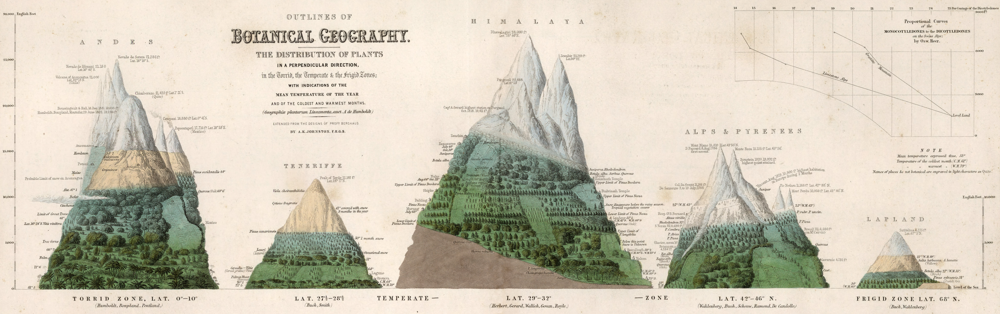

The theoretical ecology lab at the University of Michigan-Flint was started in Fall 2025 by Athma. The broad goal of our lab is to build theoretical foundations to address empirically relevant problems in ecology. We acheive this goal as a team by developing the skills of a mathematical modeller while actively following recent developments in the field of ecology. Explore the website to learn about the research we do and join our nascent team!

:::{./column-page}
{fig-alt="The Distribution of Plants in a Perpendicular Direction in the Torrid, Temperate & the Frigid Zones: with indications of the mean temperature of the year and the coldest and warmest months - Alexander von Humboldt - 1850"}
:::
