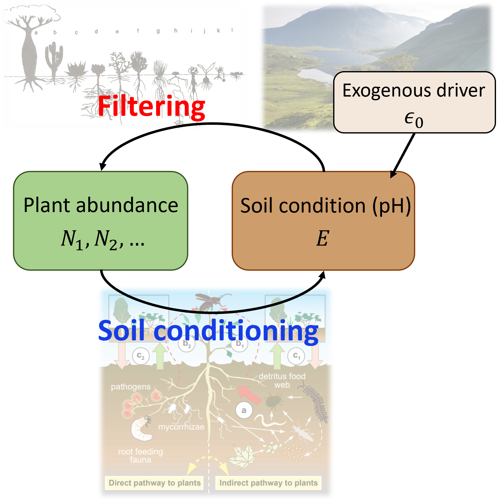
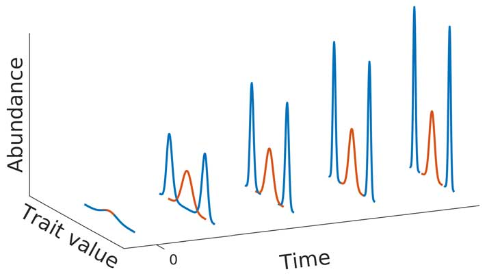

Current research in the lab fall into two major themes: (i) Plant-soil feedback and (ii) Eco-evolutionary dynamics.

### Plant-Soil feedback
::: {layout-ncol=2}
::: {#first-column}
We aim to develop a conceptual framework to scale individual plant-soil interactions to plant communities. Some of the specific questions we address include:

* Are there signatures of plant-soil feedback in community composition, spatial distributions and trait patterns which are distinguishable from other community assembly processes?
* How does the spatial extent of soil conditioning by plants and plant response to the soil conditions affect plant coexistence? 
:::

::: {#second-column}
{fig-alt="Concept map showing feedback between plant abundance and soil condition with an exogenous driver of the soil condition"}
:::
:::

### Eco-evolutionary dynamics
::: {layout-ncol=2}
::: {#first-column}
We aim to identify biological contexts in which evolutionary models cannot overlook ecological dynamics and ecological models cannot overlook trait dynamics. Some of the specific questions we address include:

* How do we quantify the relative speed of ecological and evolutionary dynamics in empirical systems to determine when eco-evolutionary models are appropriate?
* What are the ecological consquences of rapid trait evolution?
* Is speciation categorically different when microbially mediated traits are involved?
:::

::: {#second-column}
{fig-alt="Trait distribution of two species changing over time"}
:::
:::
